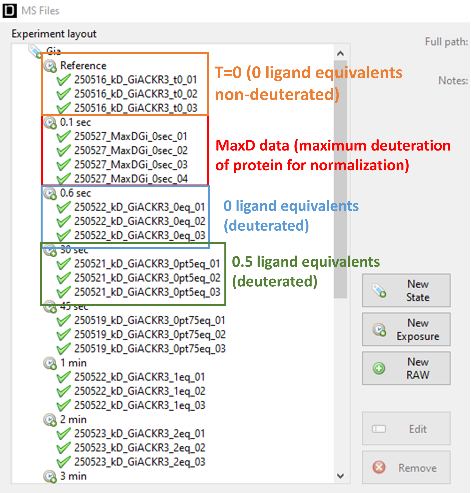

## PLIMSTEX
### Python implementation of PLIMSTEX

This is a Python-based implementation of the approach to quantifying protein-ligand interaction by mass spectrometry, titration and H/D exchange (PLIMSTEX) proposed by [Zhu *et al.*, 2004](https://doi.org/10.1016/j.jasms.2003.11.007).

For now, only 1:1 protein-ligand stoichiometry can be analysed with this code, which was developed to analyse interactions of GPCRs with G proteins, a known 1:1 stoichiometry. The theoretical basis of 1:N stoichiometry is outlined in the 2004 paper by Zhu *et al.*. 

---
### Installation
#### Pre-requisites
**Python 3.11** or higher

---
#### Installing in a clean Conda environment 
   ```bash
   conda create -y -n pyplimstex python=3.11
   conda activate pyplimstex
   pip install git+https://github.com/fooMatt/PyPLIMSTEX.git
   ```

---
### Usage
   You can modify to the template `config.toml` file in `assets/`.
   
   Note that the user still needs to 'pre-process' the HDX-MS data in DynamX and export this as a cluster CSV file as this code is unable to read the raw HDX-MS data. Below we briefly explain how to do this for PLIMSTEX data.

   DynamX assumes the user wants to plot the relative deuterium uptake over time for a given sample. In PLIMSTEX, we keep the incubation time of the two proteins constant (when mixing and in the deuterated solvent) but vary the ligand concentration. Therefore, when analysing PLIMSTEX data in DynamX, one should substitute the ligand concentration equivalents for the time (e.g. 1 equivalent of ligand == 1 minute in DynamX). The reference in DynamX is the non-deuterated protein that serves as the baseline measurement to calculate the mass change. One should put the 

   If a maximum deuteration value is used for normalisation, the 'maxD' should be listed as the smallest possible time value after t=0 (the non-deuterated reference sample) in DynamX (e.g. one could put t = 0.1 sec). In this case, the 0 equivalent deuterated sample (protein-only but exposed to deuterated solvent) should be the second-smallest possible time value after t=0 (e.g. t = 0.5 sec). PyPLIMSTEX will assign the correct labels internally following this convention.

   See the image below for an example of how data should be organised in DynamX before exporting the cluster CSV. 

   


   Once the config TOML file has been set up, run:
   ```bash
   pyplimstex --config path/to/config.toml (optionally: --workers NUM_WORKERS)
   ```
---
### Output 
   For every peptide in the cluster CSV file, PyPLIMSTEX will create 1 PNG with the experimental data points used for fitting and the modelled curve for all pseudo-bootstrap iterations plotted on the same axes. Basically, if you choose 30 iterations, it will try to fit the curve 30 times on a random subset of the experimental data points and plot these 30 fits. 
   
   The experimental data points chosen as well as the modelled data points are saved as individual CSV files for each peptide. Inside, every X and Y value pair is associated with an iteration, so plots of individual iterations can be created. Poorly fitting iterations can thus be removed if desired by the user.

   The values of the mean estimated KD and mean R² of fit for each peptide are also saved in a CSV. There would be 1 estimated KD and 1 R-squared of fit value per iteration. Poor iterations can also be removed and the mean of these parameters recalculated, if the user desires.

   In short, each peptide will give 1 PNG with the default plot and 3 CSVs for the plotted data and the KD / R² values.

---
Made at the *Institut de Génomique Fonctionnelle*, Montpellier

Granier-Mouillac Team

Matthew Chee, 2026