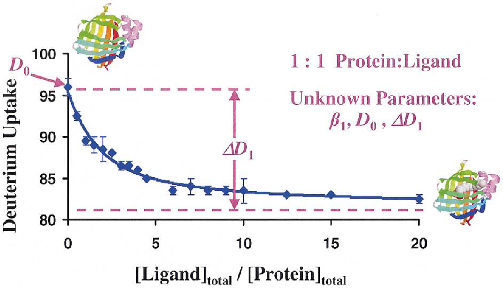

# PyPLIMSTEX User Guide

PyPLIMSTEX is a command-line tool for fitting PLIMSTEX (Protein-Ligand Interactions by Mass Spectrometry, Titration and H/D EXchange) curves to HDX-MS data. It takes deuterium uptake data exported from DynamX and, for each peptide, estimates a dissociation constant (K<sub>D</sub>) by fitting a 1:1 binding model to the shift in deuteration across a ligand titration.

> **Note 1:** Only 1:1 protein–ligand stoichiometry is supported. This tool was initially built for GPCR–G protein interactions, a well-established 1:1 system. The model for 1:1 binding is as follows:

$$ D(K, D_0, \Delta D_1, [Ligand_{total}]) = D_0 - \Delta D_1 \cfrac{[Prot-Lig-Complex]}{[Protein_{total}]} $$

> **Note 2:** We use Waters DynamX for analysis of HDX mass spectra, which creates a 'Cluster' CSV file as an output. This code assumes the use of such a file as input data and will probably not be compatible with other formats.

---

## 1. Installation

**Requirement:** Python 3.11 or higher.

If you don't have a Python environment set up, install Anaconda/Miniconda first.

In a clean conda environment:

```bash
conda create -y -n pyplimstex python=3.11
conda activate pyplimstex
pip install git+https://github.com/fooMatt/PyPLIMSTEX.git
```

---

## 2. Preparing your data

PyPLIMSTEX does **not** read raw HDX-MS instrument data. You must first process your experiment in **DynamX** and export the results as a **Cluster CSV** file. This CSV is the required input.

Your DynamX export should include, for each peptide:
- A `t0` (undeuterated) timepoint
- A series of ligand titration points (increasing ligand:protein ratios)
- Optionally, a `maxD` (fully deuterated control) timepoint, if you want to normalise data to % maximum uptake

If your DynamX file still contains multiple charge states per peptide (e.g. you forgot to filter to one charge state per peptide), don't worry — PyPLIMSTEX automatically keeps only the most frequently observed charge state per peptide and discards the rest.

> **Note:** It would be ideal to have as many points as possible between 0-1 equivalents of ligand as the titration curve has the steepest slope at this region.


Figure from Zhu, M.M. *et al.* (2004), *J. Am. Soc. Mass Spectrom.* https://doi.org/10.1016/j.jasms.2003.11.007

---

## 3. Configuring a run: `config.toml`

All run parameters are set in a single `config.toml` file. Copy the template from `assets/config.toml`, then edit the fields below.

| Setting | Description |
|---|---|
| `input` | Path to your DynamX Cluster CSV file |
| `output` | Path to the folder where results will be saved (created automatically if it doesn't exist) |
| `renumber` | Integer offset added to residue numbering (e.g. to align with a different construct numbering) |
| `protein_conc` | Total protein concentration in the deuterated sample, in µM |
| `kd_init` | Initial estimate of K<sub>D</sub>, in µM |
| `d0_init` | Initial estimate of deuteration at zero ligand (Da, or % uptake if normalising) |
| `dd1_init` | Initial estimate of the total deuteration change on saturation (Da, or % uptake if normalising) |
| `outlier_threshold` | Tolerance for excluding outlier replicate points. Higher = more tolerant. Set to `0` to disable outlier removal |
| `bootstrap` | Number of pseudo-bootstrap fitting iterations per peptide |
| `maxd_exists` | `true` if your CSV contains a maxD control timepoint |
| `normalise_maxd` | `true` to express deuteration as % of maxD instead of absolute Da (requires `maxd_exists = true`) |
| `do_ode` | `true` to solve free ligand concentration numerically (ODE, via `solve_ivp`); `false` to use the closed-form analytical solution. Both should give equivalent results — ODE is a useful cross-check |
| `remove_badfits` | `true` to discard bootstrap iterations where the fit's R² falls below 0.25, and retry until enough good fits are collected |

**Tip:** if `normalise_maxd = true` but `maxd_exists = false`, the tool will automatically disable normalisation and print a warning — it can't normalise to data that isn't there.

> **Note:** We include both the ODE approach (slower) and the analytical approach (faster) because the original creators of PLIMSTEX use an ODE approach, likely due to their application of PLIMSTEX to the general 1:N stoichiometry case. For 1:1 binding, both approaches should give equivalent results. In any case, our code is not yet designed to analyse the 1:N case.   

---

## 4. Running an analysis

Once your `config.toml` is ready:

```bash
pyplimstex --config path/to/config.toml
```

Optionally, control how many parallel worker processes are used (default is 4):

```bash
pyplimstex --config path/to/config.toml --workers 8
```

Each peptide is fitted independently in its own worker process, so increasing `--workers` (up to your CPU core count) speeds up analyses with many peptides.

While running, PyPLIMSTEX prints a live progress display showing how many peptides have succeeded, failed, or been cancelled, updating roughly every 15 seconds.

---

## 5. What happens during a run

For each peptide, PyPLIMSTEX:

1. Calculates the average t0 deuteration (and maxD, if normalising).
2. Computes the change in deuteration (ΔD) at each ligand equivalent relative to t0.
3. Removes statistical outliers among replicate ΔD values at each titration point (unless `outlier_threshold = 0`). Symmetric spread between replicates is treated as genuine variance and left untouched — only clearly one-sided outliers are stripped.
4. Runs a pseudo-bootstrap: repeatedly resampling one replicate per titration point and fitting the 1:1 binding model (D0, ΔD1, K<sub>D</sub>) via least-squares (L-BFGS-B), for the number of iterations set by `bootstrap`.
5. Aggregates the K<sub>D</sub> estimates across all bootstrap iterations to report a mean ± standard deviation, along with mean R².

Peptides missing t0 data (or maxD data, if normalising) are automatically skipped with a warning, rather than aborting the whole run.

---

## 6. Output files

For every peptide successfully analysed, two files are written to your `output` folder:

- **`PLIMSTEX fit for <start>-<end>_<sequence>.png`** — a plot of all bootstrap fits overlaid on the experimental data, annotated with mean K<sub>D</sub> ± SD and mean R².
- **`Estimated KD and R-squared of fits for <start>-<end>_<sequence>.csv`** — the K<sub>D</sub> and R² value from every individual bootstrap iteration, for further statistical analysis.

---

## 7. Troubleshooting

- **"only X/Y fits passed R² ≥ 0.25"** — the model consistently fits your data poorly for that peptide. Try adjusting `kd_init`, `d0_init`, or `dd1_init` to better match your expected values, or check the peptide's data quality/outlier settings.
- **A peptide is silently skipped** — check the console warnings; it's most likely missing t0 (or maxD) data in the input CSV.
- **Results look unstable between runs** — increase `bootstrap` for more robust averaging, and/or review `outlier_threshold` if replicate data is noisy.

---

## 8. Citation

The PLIMSTEX method implemented here is based on:

Zhu, M.M. *et al.* (2004), *J. Am. Soc. Mass Spectrom.* https://doi.org/10.1016/j.jasms.2003.11.007
